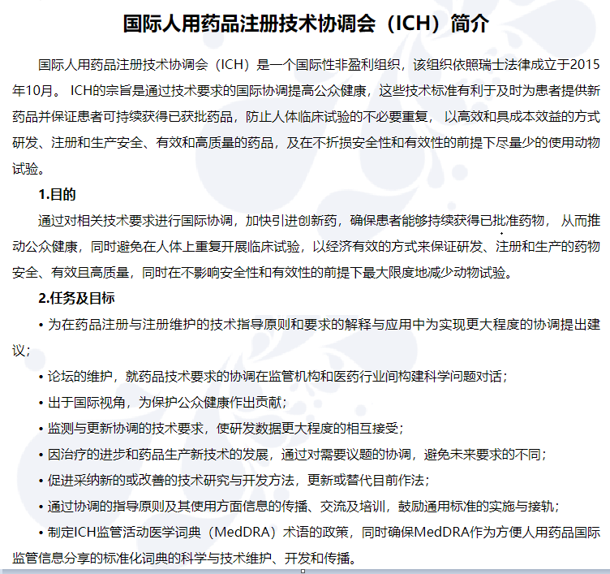

# Guidance

## ICH
### ICH 简介

## ICH 相关指南与标准
### ICH Harmonisation Activities（非遗协调活动）
- 协调过程（Process of Harmonisation）
- 公众咨询（Public Consultations）
- 指南实施（Guideline Implementation）

### ICH Guidelines（ICH 指南）
- 质量指南（Quality Guidelines）
- 安全指南（Safety Guidelines）
- 疗效指南（Efficacy Guidelines）
- 多学科指南（Multidisciplinary Guidelines）

### ICH Standards（ICH 标准）
- MedDRA
- CTD
- 电子标准（ESTRI / Electronic Standards）
________________________
## GCP 药物临床试验质量管理规范
### GCP 内容范围与应用简介

GCP（Good Clinical Practice，药物临床试验质量管理规范）是一套国际公认的伦理和科学质量标准，适用于设计、实施、记录和报告涉及人体受试者的临床试验。其核心内容包括：

- 受试者权益保护：确保受试者的安全、健康和隐私权利得到尊重和保护。
- 伦理合规：要求所有临床试验遵循伦理委员会审查和批准，符合伦理原则。
- 试验方案与数据管理：规范试验设计、实施、数据采集、记录、分析和报告，确保数据的真实性、准确性和完整性。
- 研究人员与机构职责：明确研究者、申办方和机构的责任分工与资质要求。
- 质量控制与监督：强调全过程的质量管理和监查，确保试验过程可追溯、结果可靠。

**应用场景**  
GCP 规范广泛应用于新药临床试验、医疗器械临床研究、生物等效性试验等领域，是药品注册和国际数据互认的基础。结合SAS编程，GCP要求数据处理和统计分析过程符合规范，保障试验数据的合规性和科学性。  
________________________
## 监管机构指南
### FDA
##### 21 CFR Part 11 内容范围与应用简介

21 CFR Part 11 是美国食品药品监督管理局（FDA）颁布的关于电子记录和电子签名的法规，适用于制药、医疗器械、生物技术等行业。其核心内容包括：

- 电子记录的真实性与完整性：规定电子记录必须与纸质记录具有同等法律效力，确保数据的真实性、准确性和完整性。
- 电子签名的合法性：明确电子签名的定义、使用要求及其法律效力，确保签名可追溯、不可否认。
- 系统验证与安全控制：要求对用于生成、维护电子记录和签名的系统进行验证，确保系统安全、可靠、防止数据篡改。
- 审计追踪与访问控制：规定必须具备审计追踪功能，记录所有关键操作，并对系统访问进行严格控制。

**应用场景**  
21 CFR Part 11 广泛应用于药品研发、临床试验、生产质量管理等环节，特别是在使用SAS等统计分析和数据管理系统时，需确保电子数据的合规性和可追溯性，以满足FDA的监管要求。

## CDISC
### CDISC 内容范围与应用简介

CDISC（Clinical Data Interchange Standards Consortium，临床数据交换标准协会）是国际公认的临床数据标准化组织，致力于制定和推广临床试验数据的标准格式与规范。其核心内容包括：

- SDTM（Study Data Tabulation Model）：临床试验原始数据的标准化结构，便于数据提交与监管审查。
- ADaM（Analysis Data Model）：用于统计分析的数据集标准，确保分析数据的可追溯性和一致性。
- Define-XML：用于描述和传递数据集结构及元数据的标准格式，支持数据透明和自动化处理。
- 其他标准：如SEND（非临床数据标准）、ODM（操作数据模型）等，覆盖临床及非临床研究全流程。

**应用场景**  
CDISC 标准广泛应用于新药临床试验数据的收集、整理、分析和申报，已成为FDA、EMA等国际监管机构的数据提交要求。结合SAS等统计工具，CDISC标准有助于提升数据质量、提高工作效率，实现全球范围内的临床数据共享与互认。
**单独设立板块（见第二部分），与行业规范联动说明其重要性。**
